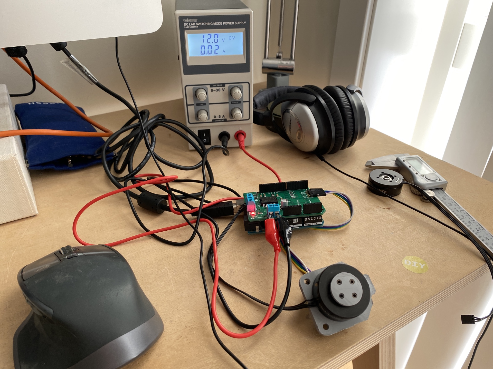

# Haptic Knob Interface

I want to have knobs that uses torque and position control to provide a diverse and muli-purpose interface. Essentially I want to be able to modulate torque based on selected application. Random Access Project gives a good summary in [this](https://www.youtube.com/watch?v=9Eh1p_rUQMA) video. I think interfaces like this also holds potential for machine control. I'm imagining an interface that could enable users to feel / interact in more tangible ways by reflecting stock or machine properties through torque. More reflections about this later. I want to implement!

I have aquired some key ingrediences to get me started. I won't explain the details behind BLDC control and FOC, but here is a list of useful links and resources:

- [Jake's notes on BLDC drivers](https://gitlab.cba.mit.edu/jakeread/atkbldcdriver/-/tree/master/education)
- [Great Scott](https://www.youtube.com/watch?v=Nhy6g9wGHow&feature=emb_logo)
- [Trinamic: look to datasheet](https://www.trinamic.com/products/integrated-circuits/details/tmc4671/)
- [Book: Electric Motors And Drives](https://www.sciencedirect.com/book/9780080983325/electric-motors-and-drives)

I'm thinking that my knobs will not require a lot of torque and current. so I dont really need a superpowerful driver; for first round of implementation I will have a go with the [L6234](https://www.st.com/resource/en/datasheet/cd00000046.pdf) which should give me up to 5Amps to make my coils move. These are nicely baked into the [simpleFOC](https://simplefoc.com/#simplefoc_shiled). As I get comfortable I might come back to this point and readjust course by making a more customized circuit board.

## Log

# 01022021

Made good progress on both parts assembly and testing of my initial prototype. At this point in time I have a working prototype of the setup; I have a working implementation of FOC on a knob that consist of 3D printed parts. But it is a rough build centered around a 3D printed shaft. For my next move I want to incorporate some real parts; a precission steel shaft with a bearing for support and a polulu mounting hub. This should improve the knob feeling I'm longing for drastically. I've put together a parts list with supplier [here](https://docs.google.com/spreadsheets/d/1L6t7pLEjz3Pts3YDK6dYrAYIaIHmlakXx8iCuhCMrLw/edit?usp=sharing).

I've updated the CAD model of the knob assembly to fit this new pattern. I will document this in more detail in future. Here is a quick screenshot from fusion:

As for testing results I'm including some plots of the knobs dynamics. Here is a plot of me setting knob angle in software. Red line is angle from encoder and gray line is knob rotational velocity.

and here is a plot of me interacting with the knob:

There is a small amount of overshoot, which I think is not a big problem at this point. I will circle around and spend more time on tuning once I have proper mechanics implemented.

Next step will be to print new parts and wait for shaft and mounting hub. Excitement!

!!!! I just realised that I can't fit the 5mm shaft in my current motor setup. This is terrible. I'm now by the grace of wheater the supplier can update my order or not. If not we are going over to T-motors $$$$. Bad Frikk.

# 25012021

Time is short. I've figured out where I want to go with this. This thing will be heavily inspired by teenage engineering's [ortho remote](https://teenage.engineering/products/orthoremote), but with the addition of dynamic torque / haptics. I'll come back with a more serious mockup of the direction in very near future.

As for the embedded / hardware prototype I have a couple of main notes. I think I want to use a ~~SAMD21~~ SAMD5x microcontroller family together with a L6234 to make this thing move. I have a couple of things I need to figure out before I advance on any serious desigs. As of now these things are:

- use simpleFOC to explore L6234
- use MKR1010 to explore SAMD21
- figure out a setup where these are powered by a LiPo battery (thing I need a boost converter to do this)

# 26122020

First jab on a prototype. I'm using an AMT103 capasative encoder which is a shaft-encoder, so I need to figure out a way to make this work with my hollow shaft motor. As a first instance I'm content with a 3D printed shaft to make this work. I can return to this point in the future. With this out of the way, the rest of the design should be fairly easy to put together. I'm aiming for a 3D printed instance of this that I can use for testing. I will think more about casing and detailing layout later. Some Nils Frahm and Fusioning gave me this:

# 31122020

I need to start keeping track on offsets that I use in 3D print design. Too much time has been wasted. I've started a sheet where I keep track of this [here](https://docs.google.com/spreadsheets/d/1FFUu7XrTB8tco7_t6ya7o5u4sKuB1yexN5Hv9sAugUY/edit#gid=0).

Also, it seems like my hacky 3D printed encoder-shaft needs to be 3D printed slooow for accuracy. Current settings 40mm/s with 0.1 layer height.
