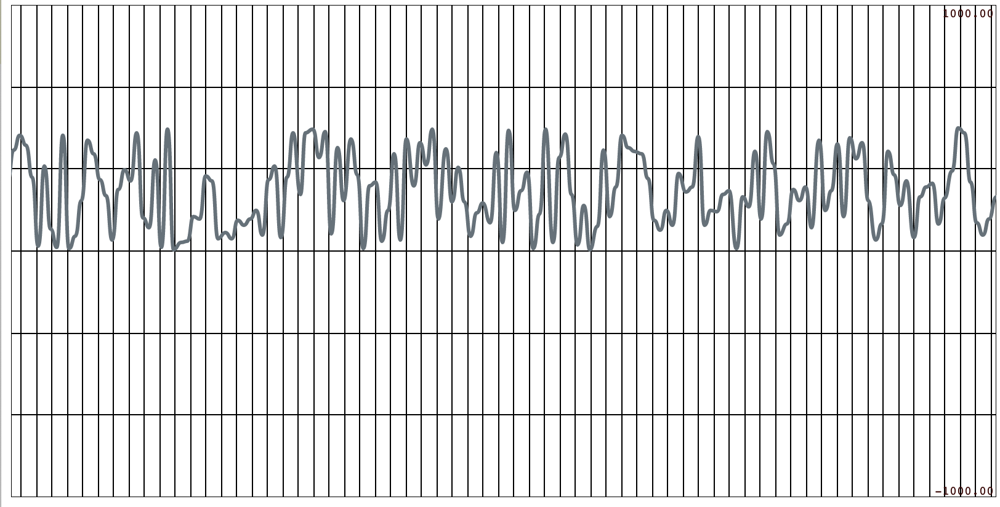
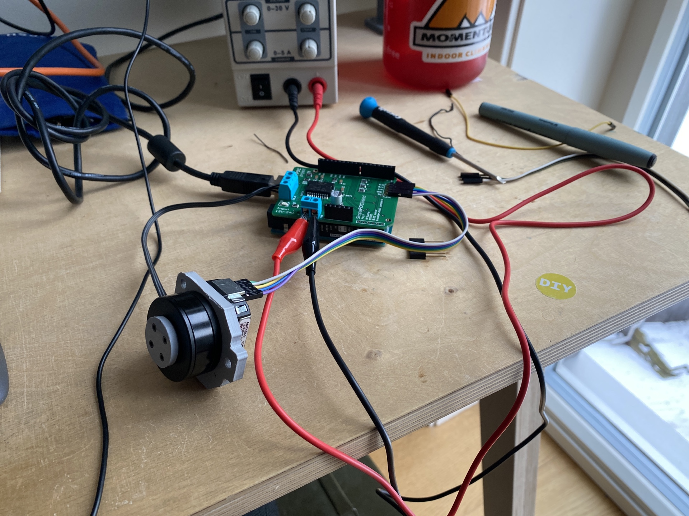

# Dev log for haptic circuit

This is my first round of designing circuitry using PCB software AND(!) ordering a pcb from a vendor. Excitement is very high! Since I have a SAMD21 at hand (Arduino MKR1010) I will use this as the basis of my circuit. The gimbal motors I will be using to actuate things should'nt require too much heavy lifting, so for pushing current into the coils I will be using the L6234. I also need to figure out some kind of encoder connection. So, summary design requirements:

- SAMD21 circuitry (usb connections, bootloader upload, power, indicators)
- L6234 circuitry
- Encoder connections.

For design I will be using the Eagle integration in Fusion360. For best practice circuit design (my electronic design skills are weak) I will use [SparkFun](https://cdn.sparkfun.com/assets/4/4/f/2/a/Qwiic_Pro_Micro_V2_0_USB_C_Schematic.pdf) schematics (just pick any board that is remotely close to what you are doing and study schematics). A lot of the circuit "modules" are repetative (e.g voltage regulators, JTAG for bootloading, USB for coms, etc).

I will also attempt to use JLPCBs SMT assembly service, so componentes need to match their inventory (which seems to be quite abundant).

These are the highlights of what I need to figure out

- How to bootload? I think both CBA and Sparkfun has some good documentation about this. More will follow
- How to control voltage? Sparkfun has alot of examples.

# 29012021

Yesterdays adventure sent me into a world good ol' fashion control theory engineering. I have returned to the domain of signal processing and tuning PID controllers. Lucky me I have a diploma lying around somewhere in this domain. Unlucky me I didn't really understand much of this when I was learning it, and I didn't really have a practical "hanger" to secure the knowledge I was exposed to. Well, now I'm back and I am hungry to understand.

My knob interface requires a fast and stable system in order to feel good. At the end of the day, this is a human interaction so we don't need to move in light speed, but the circuit driving the interaction needs to be fast and snappy in order to make the magnetic field turning / resisting the knob feel good. I also have the impression that if the controller PWMing the magnetic field is blazing fast, I will get rid of the field humming that I am currently experiencing using the Arduino Mega (which is really the atMega328 clocking away at 16Mhz). The SAMD2x series has a clock speed of 48Mhz, which should make the PWMing much smoother. However, I now see that the SAMD5x series has a clock speed of 120Mhz. Further thoughts are needed on this point. Im noting this as a **return in the future**. Some numbers to work on:

`I can hear 20kHz`

`I can see roughly 50Hz`

`ATmega328 clock speed 16Mhz`

`ATSAMD2x clock speed 48Mhz`

`ATSAMD5x clock speed 120Mhz`

`Human hearing is between 20 - 20k Hz`

For now, I think I shouldn't worry too much about sampling rate in terms of me perceiving the response on a screen. A general thought I have is that I want to be able to view the data from the system in browser. This means having some kind of server receiving data over serial port and pushing the data into the browser over web sockets (TCP), which should cause some delay in terms of real-time monitoring. I think this delay is not really a problem. For now, I will stick to this architecture and see where it takes me, and learn about these problems as I go along. Here we go.

General plan going into this. Express server based on node.js has to do three things:

- Read serial data
- Host web-client that includes charts.
- Host web socket server that pushes data into web-client

I will be using [smoothie charts] for visualization and socket.io for web sockets. Smoothie has a wonderful tool for pre-designing charts [here](http://smoothiecharts.org/builder/).

Implementation is semi-successful. I am parsing serial data on server side, and I am sending it to browser. On client side I am running smoothie charts. I need to spend more time on parsing before I send over socket. Out of time now. For now I will end on a chart full of random data points sent over socket.

Will try to return later today and fix this.

# 28012021

I've made a working prototype of the circuit using the SimpleFOCshield and a Arduino UNO (I know, its not the SAMD21, but we'll return to that in a moment). The setup I'm using is fairly well documented on SimpleFOC site. In short, cheap gimbal motor from [Ebay](https://www.ebay.com/itm/BGM2804-Brushless-Gimbal-Motor-Hollow-Shaft-for-Camera-Mount-FPV/172292079620?ssPageName=STRK%3AMEBIDX%3AIT&_trksid=p2057872.m2749.l2648), [CUI AMT103](https://www.digikey.com/en/products/detail/cui-devices/AMT103-V/827016) encoder, SimpleFOC shield on a Arduino UNO connected to a 12V PSU.

This is a much better starting ground, and I feel more confident at the moment. I have a working closed loop position program. The PID controller in the FOC algorithm comes with default parameters that feels kind of slow and not snaggy as I imagined. I need to spend some time here to get the right feel. Next thing on the todo-list is to visualise set-point vs response and start tuning. Exciting! Some parameters so I don't repeat myself:

Motor:
`BLDCMotor motor = BLDCMotor(9, 10, 11, 7, 8);`

Encoder:
`Encoder encoder = Encoder(2, 3, 2048);`

Slow but staple PI (D) controller:

`motor.PID_velocity.P = 0.2;`

`motor.PID_velocity.I = 63;`

`motor.PID_velocity.D = 0;`

I'll leave this for now and return with plots in near future.

# 27012021

Ok. I've done some research and I have a rough idea of what I want to do.

First, battery circuit: I want to use [this](https://www.sparkfun.com/products/15217) piece from Sparkfun to do charging. I've checked JLCPCB and they have the [MCP73833](https://jlcpcb.com/parts/componentSearch?searchTxt=MCP73833) chip it uses. STOP: before I choose this, I have to settle on what kind of battery I want to use - normal LiPo might not be the answer since we ideale want semi high voltage for the motor. [Sparkfun](https://learn.sparkfun.com/tutorials/battery-technologies?_ga=2.140291248.2000713736.1611752464-138398380.1611218857) has a good guide on picking batteries here.

_time goes by_

I have to do more research here. It might be a good idea to separate motor control from battery circuit. Question to ponder here; can I run the motor on 5V? In that case I can piggyback on the [Adafruit PowerBoost](https://www.adafruit.com/product/2465) design. Next step on this point will be to do some lab testing with the L6234 and the motor I have at hand. God I want this to work. Update: No good. It looks like most gimbal motors require 3-4s Lipo packs, which makes sense; there are a lot of windings and it will require a decent amount of pushing force to push current through the windings. Ok. Back to the drawing board. I found a new search phrase that might be useful: BMS circuits. Have a look at [this](https://electronics.stackexchange.com/questions/317019/diy-18650-4s-battery-pack-how-to-charge-how-to-build) thread.

I'm considering just skipping this part for now, and just have the projects either use AA batteries, or just connect to power source.

Moving on. I think that the SAMD21 chip has internal pull-ups that I can use, so for now I will not worry about this. I'm noting this as a point to come back to before I order the design. Also, SAMD21-vise, there is a lot of good reference designs to follow; CBA, Adafruit and Sparkfun. As for now, I will follow intuition, and then use one of these to verify myself.

I found several good references on how to design the circuit around the L6234 chip. The best one so far (maybe not a big surprise) is the one in the data sheet. But references are always good!

# 26012021

Started on schematics. Learned tons about Fusion360 electronics design. It's quite neat actually. There are already tons of components and libraries available through [Library.io](library.io). I added SAMD21 QFN32 package to the library following [this tutorial](https://www.youtube.com/watch?v=zqar0XWtFaY).

So far I think I've figured out voltage regulator for the controller, but I have to study it a bit more to understand it. I think I saw a guide on best practice on Sparkfun at some point. Also conflicted about whether I should choose USB type B or the future Type C. I also need to figure out how this whole bootloader uploading business works. I think cba/Jake has some guide [documentation on this](https://gitlab.cba.mit.edu/jakeread/arm-target-programming).

More on this next time. As for now, I will consider this a good start.
2
